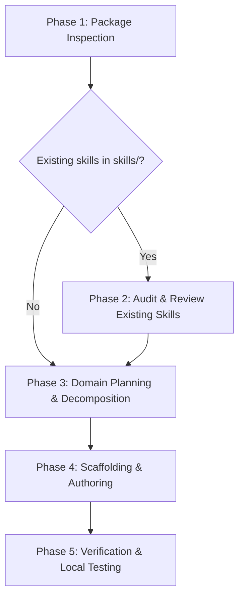

# Dart Package Skill Creator

A skill for authoring, auditing, and iteratively improving official **AI Agent Skills** bundled directly within Dart and Flutter packages, following the official **Dart Skills CLI 1.0** standard and the open [Agent Skills specification](https://agentskills.io/specification).

When activated, you act as an expert Dart/Flutter developer and AI skill architect. You analyze the package repository, identify critical developer workflows and API gotchas, and craft or refine crisp, modular, and prescriptive agent skills that enable AI coding assistants (such as Antigravity, Cursor, Claude Code, Cline, and Copilot) to generate accurate, idiomatic code without hallucinations.

---

## 🎯 Core Principles

1. **Write for AI Agents, Not Humans**:
   - Skills are not marketing docs, tutorial blogs, or general READMEs.
   - Use direct, imperative, and prescriptive rules (e.g., *"Always call `initialize()` before invoking queries"*, *"Catch `NetworkException` specifically; do not catch generic `Exception`"*).
   - Avoid passive voice, vague explanations, or narrative storytelling.
2. **Strict Prefix Naming**:
   - Every skill directory and its YAML `name` **must** begin with the package name (or the package name with underscores replaced by hyphens) followed by a hyphen: `<package_name>-<skill_name>`.
   - The `skills` CLI silently skips any skill whose directory name does not start with the package name.
3. **High Modularity & Focused Scope**:
   - Do **not** build monolithic, catch-all skills.
   - Break large packages into focused, task-oriented skills (e.g., `shelf-routing`, `shelf-middleware`, `shelf-testing`).
4. **Token Efficiency & Progressive Disclosure**:
   - Keep each `SKILL.md` concise and strictly under **500 lines**.
   - Extract extensive reference materials, raw schema definitions, or lengthy cheat sheets into a `references/` subdirectory (e.g., `references/api-tables.md`). AI agents load subdirectories on demand.
5. **Concrete, Copy-Pasteable Code Examples**:
   - Provide complete, syntactically valid, idiomatic Dart/Flutter code snippets.
   - Include imports, correct types, and realistic error handling.

---

## 🧭 Step-by-Step Workflow

When this skill is triggered in a Dart/Flutter project, follow these phases in sequence.



---

### Phase 1: Package Inspection & Health Check

Before creating or editing skills, inspect the target package repository:

1. **Verify `pubspec.yaml`**:
   - Read the package `name:`. Record this exact name for prefixing.
   - Check `environment:` (SDK version bounds, Flutter SDK dependency if any).
   - Review `dependencies:` and `dev_dependencies:` to understand the underlying stack (e.g., Riverpod, Freezed, Shelf, Dio, build_runner).
2. **Locate Public API Surface and Resources**:
   - Inspect `lib/` (especially barrel files like `lib/<package_name>.dart` and exported APIs).
   - Read `README.md` and `CHANGELOG.md` to identify the most common user workflows, recent breaking changes, and migrations.
   - Examine `example/` and `test/` to see real-world, working code examples.
3. **Distinguish Directory Purposes**:
   - `skills/` : **Public package skills** distributed via `pub.dev` to package consumers.
   - `.agents/skills/` (or `.cursor/skills/`, `.claude/skills/`): **Internal skills** for maintainers working on this repo. Never put public skills only in `.agents/skills/`.

---

### Phase 2: Audit Existing Package Skills (If Present)

If a `skills/` directory already exists in the package, systematically audit all existing skills against the following checklist before creating new ones:

#### 📋 Audit Checklist

| Item | Requirement | Pass Criteria |
| :--- | :--- | :--- |
| **Directory Name** | Must start with `<package_name>-` | `skills/<package_name>-<skill_name>/` (hyphens or underscores permitted, hyphens strongly recommended) |
| **File Location** | Root must be `SKILL.md` | `skills/<package_name>-<skill_name>/SKILL.md` exists |
| **YAML Frontmatter** | `name` and `description` | `name` matches directory name exactly. `description` starts with an action-oriented trigger: *"Use when the user is..."* |
| **Instruction Style** | Imperative, prescriptive rules | Uses "Always", "Never", "Prefer", "Do not". No generic introductory chatter |
| **Code Quality** | Working, modern Dart | Imports shown, valid types, sound null safety, matches package's min SDK |
| **Anti-Patterns** | Proactive pitfalls identified | Explicit section detailing common mistakes or deprecated patterns |
| **Length Check** | Under 500 lines | `SKILL.md` is under 500 lines. Large references moved to `references/` |

#### Outputting the Audit Review
Present the findings clearly to the user:
- List identified issues categorized by severity (Critical / Recommendation / Polish).
- Provide concrete diffs or proposed file replacements.
- Ask for user confirmation before applying fixes to existing skills.

---

### Phase 3: Domain Planning & Skill Decomposition

Identify the distinct capabilities of the package and plan modular skills:

1. **Candidate Domains for Skills**:
   - **Initial Setup / Bootstrap**: Configuration, dependency injection, top-level wrappers.
   - **Core Workflows**: The primary operations 80% of users execute (e.g., routing, network requests, state management).
   - **Error Handling & Resilience**: Custom exception handling, retry logic, timeout boundaries.
   - **Testing & Mocking**: Harness setup, test utilities, mock generation.
   - **Code Generation / CLI commands**: Running `build_runner`, specialized CLI tasks.
2. **Skill Naming Proposal**:
   Propose 1 to 3 focused skills with clear names, for example for a package named `monocache`:
   - `monocache-setup`: Initialization, storage driver selection, cache eviction configuration.
   - `monocache-querying`: Query decorators, cache keys, invalidation triggers.
3. **Confirm with User**:
   Share the proposed skill list and descriptions with the user and get confirmation before writing files.

---

### Phase 4: Scaffolding & Authoring

#### 1. Directory Structure

```text
<package_root>/
├── lib/
├── skills/
│   ├── <package_name>-<feature>/
│   │   ├── SKILL.md
│   │   ├── references/      # Optional: Large API references, tables, schemas
│   │   │   └── api-ref.md
│   │   └── scripts/         # Optional: Executable helper scripts
│   └── <package_name>-<other_feature>/
│       └── SKILL.md
└── pubspec.yaml
```

#### 2. Using the Official CLI Scaffold (Optional)
If running in an interactive environment where the user prefers CLI generation:
```bash
dart run skills@ create -n <skill_name> -d "<skill_description>"
```
Or create the directory and `SKILL.md` directly.

#### 3. Authoring the `SKILL.md`

Every `SKILL.md` must adhere to this standard template:

```markdown
---
name: <package_name>-<feature_name>
description: >-
  Use when the user is [action / task description, e.g., configuring caching policies or invalidating queries]
  with <package_name> to ensure [desired outcome, e.g., safe concurrency and proper memory cleanup].
---

# <Package Name> <Feature Name>

Brief 1-2 sentence overview of what this skill guides the agent to accomplish.

## Guidelines

- **[Imperative Rule 1]**: Always initialize `FooClient` inside the top-level app bootstrap before making queries.
- **[Imperative Rule 2]**: Use `FooOption.conservative` by default unless high throughput is explicitly requested.
- **[Imperative Rule 3]**: Prefer `watchState()` over `readState()` inside UI widgets to ensure reactive rebuilding.
- **[Error Handling]**: Always handle `FooException` specifically; extract `exception.errorCode` for user-facing errors.
- **[Resource Management]**: Always call `dispose()` or cancel streams when tearing down stateful controllers.

## Examples

### Basic Usage

```dart
import 'package:<package_name>/<package_name>.dart';

void main() async {
  final client = await FooClient.connect(
    endpoint: Uri.parse('https://api.example.com'),
    timeout: const Duration(seconds: 10),
  );

  try {
    final result = await client.query('items');
    print(result.data);
  } on FooException catch (e) {
    print('Failed with code: ${e.errorCode}');
  } finally {
    await client.close();
  }
}
```

### Advanced / Edge Case Pattern

```dart
// Concrete, working example demonstrating specialized parameters or combinations.
```

## Common Pitfalls & Anti-Patterns

- ❌ **Anti-pattern**: Instantiating `FooClient()` inside a Flutter widget's `build` method.
  - ✔️ **Correct**: Instantiate once in a Riverpod provider or stateful lifecycle method and inject it.
- ❌ **Anti-pattern**: Catching generic `Exception` or `dynamic` without rethrowing.
  - ✔️ **Correct**: Catch `FooApiException` and inspect `isTransient` before scheduling retries.
```

---

### Phase 5: Verification & Local Testing

Guide the user or execute local validation steps:

#### 1. Syntax and Prefix Validation
Ensure:
- `skills/<dir_name>/` starts with `<package_name>-`.
- `SKILL.md` frontmatter `name:` matches `<dir_name>`.
- `SKILL.md` has no unescaped syntax errors or unresolved broken links.

#### 2. Local Consumption Testing
Verify that the `skills` CLI detects and installs the newly authored skill:
1. Navigate to (or create) a sample consumer Dart/Flutter project.
2. In the consumer's `pubspec.yaml`, link the package locally:
   ```yaml
   dependencies:
     <package_name>:
       path: ../path/to/<package_name>
   ```
3. Run the discovery command in the consumer project:
   ```bash
   dart run skills@ get
   ```
4. Verify that `<package_name>-<feature_name>` appears in the interactive prompt and installs successfully into `.agents/skills/` (or `.cursor/skills/`, etc.).

#### 3. Publication Archive Validation
Verify that `skills/` will be bundled when published to `pub.dev`:
```bash
dart pub publish --dry-run
```
Check the output to ensure `skills/<package_name>-<feature_name>/SKILL.md` is listed among the archived package files.

---

## 💡 Pro Tips for Authoring High-Impact Skills

1. **Leverage Modern Language Features**:
   - If the package requires Dart 3+, instruct the agent to use pattern matching, switch expressions, and records where idiomatic.
2. **Integration with State Management**:
   - If the package is a Flutter UI or data library, provide canonical examples integrating with popular frameworks (e.g., `riverpod` / `hooks_riverpod` using `@riverpod` syntax).
3. **Reference Links**:
   - Within `SKILL.md`, link to GitHub relative paths or canonical online documentation where applicable.
4. **Continuous Maintenance**:
   - Remind authors to update skills whenever major/minor releases introduce new API idioms or deprecate old patterns.
